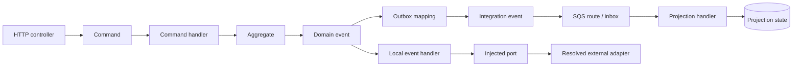

# Java Scanner Delivery Map

Last updated: 11 September 2026.

## Current position

**Lots 00, 01 and 02 are delivered. Lot 03 is next and has not started.**

```text
[00 semantics] -> [01 engine] -> [02 project context] -> [03 domain events]
      DONE             DONE              DONE                  NEXT

-> [04 HTTP/commands] -> [05 outbox/SQS] -> [06 projections]
          LATER                LATER              LATER

-> [07 externals] -> [08 CLI/MCP] -> [09 more corpora]
        LATER             LATER            LONG TERM
```

The detailed semantic decision is in
[`java-semantic-feasibility.md`](java-semantic-feasibility.md). This document is
the progress view: it should be updated when a lot is delivered, not when work
is merely proposed.

## Objective

Enable FlowAtlas to reconstruct statically justified Java backend architecture
through the same small vocabulary already used for Redux:

```text
Handler --LISTENS_TO------> Event
Handler --DISPATCHES------> Event
Event   --UPDATES---------> State
Handler --CALLS_EXTERNAL--> External
```

Commands, domain events, integration events and protocol signals remain
different Event identities. Java, Spring, Maven, SQS and JPA are evidence
mechanisms; none becomes a graph kind.

The target is not a Java call graph. A useful result may contain gaps when the
source does not prove how two infrastructure mechanisms connect.

## Reference vertical

The Fragments backend provides the concrete delivery path:



This diagram shows the corpus territory to investigate. Its arrows are not
automatically FlowAtlas relations. Each lot must translate only the portions
supported by static evidence into the canonical graph.

The first acceptance stays deliberately inside that larger vertical:

```text
TicketVerifyAcceptedEvent
    -> TicketVerificationProcessManager
    -> TicketVerificationProvider.verify(...)
    -> TicketVerificationCompletedEvent
```

Lot 02 proves that the Java identities remain resolvable with only the process
manager in architectural scan scope. It does not yet claim that the provider
is an `External`, nor that the process manager dispatches the completed event
in `ArchitectureGraph`.

## Delivery tracker

| Lot | Status    | Outcome                                                                                                | Evidence gate                                                                                                                  |
| --- | --------- | ------------------------------------------------------------------------------------------------------ | ------------------------------------------------------------------------------------------------------------------------------ |
| 00  | DELIVERED | Freeze the four node kinds, four relation kinds and Java Event identities.                             | Human-approved decision; no graph vocabulary change.                                                                           |
| 01  | DELIVERED | Select a Java semantic engine.                                                                         | Controlled Java 21 fixture and real Fragments Maven slice resolve types, generics, methods and locations.                      |
| 02  | DELIVERED | Load a Maven project with complete resolution context and bounded scan scope.                          | Out-of-scope sources resolve symbols without entering scope; diagnostics retain source and scope information.                  |
| 03  | NEXT      | Detect domain events, typed local handlers and proven publication.                                     | First `ArchitectureGraph` projection for the ticket-verification event slice, including important absent edges.                |
| 04  | PROPOSED  | Add HTTP protocol signals, commands and typed command handlers.                                        | Controller-to-command entry is proven without changing the meaning of Event.                                                   |
| 05  | PROPOSED  | Reconstruct outbox mappings, destination/versioned integration events, SQS routes and inbox consumers. | Producer and consumer identities remain distinct; unsupported causal gaps remain explicit.                                     |
| 06  | PROPOSED  | Detect event-fed projection State and projection-sync signals.                                         | State granularity comes from a real projection acceptance, not table-name guessing.                                            |
| 07  | PROPOSED  | Detect meaningful external boundaries through resolved adapters.                                       | A port call becomes `CALLS_EXTERNAL` only when adapter resolution proves HTTP, SQS, storage, process or persistence execution. |
| 08  | PROPOSED  | Expose Java projects through the existing CLI and MCP capabilities.                                    | Bounded Fragments projections are deterministic and preserve current TypeScript behavior.                                      |
| 09  | LONG TERM | Generalize from additional Java corpora.                                                               | Repeated evidence, not one framework convention, justifies new detectors or vocabulary review.                                 |

## What has been learned

### Lot 00 — graph semantics

- Redux Toolkit is one favorable evidence adapter, not the product model.
- `Command`, `Domain Event`, `Integration Event` and protocol signal fit as
  distinct `Event` identities.
- No new `NodeKind`, `RelationKind` or intermediate facts model is required for
  the first Java vertical.

### Lot 01 — semantic engine

- The JDK compiler API is sufficient for the smallest useful Java queries and
  adds no parser dependency.
- Fully qualified type identity rejects a class named `ConventionOnlyEvent`
  that does not implement `DomainEvent`.
- Generic supertype traversal recovers
  `EventHandler<TicketVerifyAcceptedEvent>`.
- Compiler tree elements resolve the injected call to the declaring
  `TicketVerificationProvider.verify(String, String)` method.
- Source-only analysis is incomplete for the real Maven project. A full Maven
  classpath may assist resolution while explicit source inputs keep emission
  scope bounded.
- The controlled fixture and Fragments acceptance both return exact source
  locations. The fully resolved Fragments run has no compiler diagnostics.

### Lot 02 — Maven context and scan scope

- `javaMavenSemanticContext.mjs` reads the Java release from the Maven
  properties, obtains the dependency classpath and includes available compiled
  project classes as resolution context.
- A request distinguishes `scanSources` from optional `resolutionSources`.
  Both may participate in compilation, but every returned source location is
  marked with `inScanScope` from the former only.
- Paths are normalized and source inputs must remain inside the declared source
  root.
- Compiler diagnostics retain their severity, message, source location and
  scope membership. A controlled unresolved type proves the failure path.
- In the real Fragments acceptance, only
  `TicketVerificationProcessManager.java` is in scope. Domain events,
  `EventHandler` and the provider interface resolve outside scope with no
  diagnostics.
- The capability remains an isolated spike. It does not change the TypeScript
  scanner, CLI, MCP interface or `ArchitectureGraph`.

## Fragments feedback loop

The App Store audit currently identifies two distinct opportunities:

1. TypeScript: follow injected calls inside factories and
   `createAsyncThunk` callbacks.
2. Java: reconstruct the vertical from controller and command through domain
   events, outbox and projection.

The first opportunity improves the existing Redux adapter. The second drives
this roadmap. They may share graph vocabulary, but they must not be merged into
one implementation cycle: their semantic engines and proof mechanisms differ.

The Java reference source was first pinned at Fragments commit `c5319de` and
revalidated at descendant commit `7f8c588`, after the moderation lot described
in `docs/audits/app-store-readiness-2026-09-11.md` in the Fragments repository.

## Invariants for every lot

- Begin with one acceptance RED or focused behavioral RED.
- Emit only statically justified nodes and edges.
- Treat unresolved and dynamic behavior as a gap or diagnostic.
- Keep project resolution context separate from architectural scan scope.
- Do not introduce a new graph kind, relation, facts model or structural port
  without human review.
- Finish with focused and full verification, documentation, one conventional
  commit, push and a clean worktree.
- Stop before starting the following lot.

## Next acceptance boundary

Lot 03 may introduce the first Java detector and `ArchitectureGraph` projection
for the domain-event slice. Its minimum observable contract is:

```text
TicketVerificationProcessManager.java in scan scope
            + Maven resolution context
                         |
                         v
TicketVerifyAcceptedEvent                    Event
TicketVerificationProcessManager             Handler
Handler --LISTENS_TO--> accepted Event
Handler --DISPATCHES--> completed Event       only if exact publication is proven
```

The provider call remains semantic evidence, not an `External`, until the
adapter resolution lot proves the boundary. A name-only event and unresolved
publication must remain absent.

After this first real Java graph is available, work must pause for an explicit
review of the shared scanner port. The agreed direction is a stable
language-neutral architectural port with independent TypeScript and Java
adapters—not a port that accumulates compiler-specific options. No such port
is authorized by Lots 00–03 alone.
