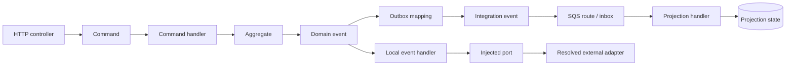

# Java Scanner Delivery Map

Last updated: 12 September 2026.

## Current position

**Lots 00 to 10 are delivered. Bounded job-worker mapping is next.**

```text
[00 semantics] -> [01 engine] -> [02 project context] -> [03 domain events]
      DONE             DONE              DONE                  DONE

                         -> [shared scanner port]
                                     DONE

-> [04 HTTP/commands] -> [05 outbox/SQS] -> [06 projections]
          DONE                 DONE               DONE

-> [07 externals] -> [08 CLI/MCP] -> [09 more corpora]
        DONE              DONE             DONE
```

The detailed semantic decision is in
[`java-semantic-feasibility.md`](java-semantic-feasibility.md). This document is
the progress view: it should be updated when a lot is delivered, not when work
is merely proposed.

## Objective

Enable FlowAtlas to reconstruct statically justified Java backend architecture
through the same small vocabulary already used for Redux:

```text
Handler --LISTENS_TO------> Event
Handler --DISPATCHES------> Event
Event   --UPDATES---------> State
Handler --CALLS_EXTERNAL--> External
```

Commands, domain events, integration events and protocol signals remain
different Event identities. Java, Spring, Maven, SQS and JPA are evidence
mechanisms; none becomes a graph kind.

The target is not a Java call graph. A useful result may contain gaps when the
source does not prove how two infrastructure mechanisms connect.

## Reference vertical

The Fragments backend provides the concrete delivery path:



This diagram shows the corpus territory to investigate. Its arrows are not
automatically FlowAtlas relations. Each lot must translate only the portions
supported by static evidence into the canonical graph.

The first acceptance stays deliberately inside that larger vertical:

```text
TicketVerifyAcceptedEvent
    -> TicketVerificationProcessManager
    -> TicketVerificationProvider.verify(...)
    -> TicketVerificationCompletedEvent
```

Lot 02 proves that the Java identities remain resolvable with only the process
manager in architectural scan scope. It does not yet claim that the provider
is an `External`, nor that the process manager dispatches the completed event
in `ArchitectureGraph`.

## Delivery tracker

| Lot | Status    | Outcome                                                                                                | Evidence gate                                                                                                          |
| --- | --------- | ------------------------------------------------------------------------------------------------------ | ---------------------------------------------------------------------------------------------------------------------- |
| 00  | DELIVERED | Freeze the four node kinds, four relation kinds and Java Event identities.                             | Human-approved decision; no graph vocabulary change.                                                                   |
| 01  | DELIVERED | Select a Java semantic engine.                                                                         | Controlled Java 21 fixture and real Fragments Maven slice resolve types, generics, methods and locations.              |
| 02  | DELIVERED | Load a Maven project with complete resolution context and bounded scan scope.                          | Out-of-scope sources resolve symbols without entering scope; diagnostics retain source and scope information.          |
| 03  | DELIVERED | Detect domain events, typed local handlers and proven publication.                                     | First `ArchitectureGraph` projection for the ticket-verification event slice, including important absent edges.        |
| 04  | DELIVERED | Add the shared scanner port, HTTP protocol signals, commands and typed command handlers.               | Controller-to-command entry is proven without changing the meaning of Event or the public MCP protocol.                |
| 05  | DELIVERED | Reconstruct outbox mappings, destination/versioned integration events, SQS routes and inbox consumers. | Two destination-specific Ticket identities and their configured consumers are proven without Event-to-Event causality. |
| 06  | DELIVERED | Detect event-fed projection State and projection-sync signals.                                         | Ticket State comes from the projection-sync contract; the ACL discontinuity remains visible.                           |
| 07  | DELIVERED | Detect meaningful external boundaries through resolved adapters.                                       | Ticket verification reaches a resolved local-process boundary; the port itself remains absent.                         |
| 08  | DELIVERED | Expose Java projects through the existing CLI and MCP capabilities.                                    | Explicit Java project/request inputs return the Fragments graph without changing TypeScript defaults.                  |
| 09  | DELIVERED | Make stale Java semantic requests actionable.                                                          | Failed requests name their request file, semantic failure and safe source-scope remediation.                           |
| 10  | DELIVERED | Improve Java integration-contract discovery aliases.                                                   | Java producer event names find their canonical integration contract without new graph topology.                        |
| 11  | PROPOSED  | Prove one injected job repository and one scheduled worker.                                            | Constructor injection and `@Scheduled` evidence remain bounded, with no generic Spring simulation.                     |

## What has been learned

### Lot 10 — integration-contract discovery

- A Java producer event type is a statically configured mapping input, whereas
  the emitted graph identity is the stable destination/type/version contract.
  Discovery now retains that exact mapping as non-canonical query metadata.
- Searching `TicketVerifyAcceptedEvent` on the real Fragments integration
  request returns the two canonical destination-specific contracts. No alias is
  added to `ArchitectureGraph`; context still starts from the canonical id.
- The metadata is discovery-only: it introduces neither a node nor a relation,
  and it cannot bridge the outbox discontinuity.

### Lot 00 — graph semantics

- Redux Toolkit is one favorable evidence adapter, not the product model.
- `Command`, `Domain Event`, `Integration Event` and protocol signal fit as
  distinct `Event` identities.
- No new `NodeKind`, `RelationKind` or intermediate facts model is required for
  the first Java vertical.

### Lot 01 — semantic engine

- The JDK compiler API is sufficient for the smallest useful Java queries and
  adds no parser dependency.
- Fully qualified type identity rejects a class named `ConventionOnlyEvent`
  that does not implement `DomainEvent`.
- Generic supertype traversal recovers
  `EventHandler<TicketVerifyAcceptedEvent>`.
- Compiler tree elements resolve the injected call to the declaring
  `TicketVerificationProvider.verify(String, String)` method.
- Source-only analysis is incomplete for the real Maven project. A full Maven
  classpath may assist resolution while explicit source inputs keep emission
  scope bounded.
- The controlled fixture and Fragments acceptance both return exact source
  locations. The fully resolved Fragments run has no compiler diagnostics.

### Lot 02 — Maven context and scan scope

- `javaMavenSemanticContext.mjs` reads the Java release from the Maven
  properties, obtains the dependency classpath and includes available compiled
  project classes as resolution context.
- A request distinguishes `scanSources` from optional `resolutionSources`.
  Both may participate in compilation, but every returned source location is
  marked with `inScanScope` from the former only.
- Paths are normalized and source inputs must remain inside the declared source
  root.
- Compiler diagnostics retain their severity, message, source location and
  scope membership. A controlled unresolved type proves the failure path.
- In the real Fragments acceptance, only
  `TicketVerificationProcessManager.java` is in scope. Domain events,
  `EventHandler` and the provider interface resolve outside scope with no
  diagnostics.
- The capability remains an isolated spike. It does not change the TypeScript
  scanner, CLI, MCP interface or `ArchitectureGraph`.

### Lot 03 — first Java ArchitectureGraph

- The compiler resolves direct calls to the configured
  `DomainEventPublisher.publish` method and records the static type of its
  argument, caller and exact source location.
- A focused Java detector maps only concrete `DomainEvent` types, a typed
  `EventHandler<E>` and in-scope resolved publications into the canonical
  graph.
- The real Fragments slice now yields:

  ```text
  TicketVerificationProcessManager
    --LISTENS_TO--> java-domain-event:...TicketVerifyAcceptedEvent
    --DISPATCHES--> java-domain-event:...TicketVerificationCompletedEvent
  ```

- `TicketVerificationProvider` remains absent because an injected port is not
  itself proof of an external execution boundary.
- The discriminated `switch` is not converted into graph branches. In this
  slice, javac proves only that the value ultimately passed to `publish` has
  the completed-event type.
- The Java adapter composes this detector behind the shared scanner port, but
  the public CLI and MCP still select only the TypeScript adapter.

### Lot 04 — shared port and HTTP/Command

- The human-approved `ArchitectureScanner` port lives at the application
  boundary. Its asynchronous contract accepts a project path and returns the
  canonical graph plus language-neutral diagnostics.
- TypeScript and Java adapters implement that port independently. Maven,
  javac, `tsconfig`, compiler reuse and Redux remain adapter details.
- The MCP now depends on `ArchitectureScanner`; its tools and wire protocol are
  unchanged. The deployed composition still selects the TypeScript adapter.
- Java scan scope remains configuration of the Java evidence loader. It was
  not added to the shared port without a second cross-language consumer.
- Configured Spring annotation identities prove the HTTP mapping. The resolved
  `CommandBus.dispatch` argument proves the dispatched command, and
  `CommandHandler<C>` proves the command listener.
- The real Fragments slice yields:

  ```text
  WriteTicketController#verify(...)
    --LISTENS_TO--> protocol:http:POST:/api/tickets/verify
    --DISPATCHES--> java-command:...VerifyTicketCommand

  VerifyTicketCommandHandler
    --LISTENS_TO--> java-command:...VerifyTicketCommand
  ```

- `CommandBus` remains an implementation detail. No `DISPATCHES` relation is
  emitted from the command handler to `TicketVerifyAcceptedEvent`: the current
  path crosses aggregate registration and `forEach(eventPublisher::publish)`,
  which Lot 04 does not prove interprocedurally.

### Lot 05 — outbox identities and SQS routes

- The selected producer is `TicketVerifyAcceptedEvent`. Its outbox metadata,
  destination resolver branch, stable type catalog, constant version and exact
  sender loop are all resolved before an integration Event is emitted.
- The same stable type/version sent to two destinations produces two distinct
  identities:

  ```text
  StableEnvelopeOutboxEventSender#send(...)
    --DISPATCHES--> integration:ticket-events:ticket.verify.accepted:v1
    --DISPATCHES--> integration:ticket-verification-requested:ticket.verify.accepted:v1

  ticketVerifyAcceptedReadSqsIntegrationEventHandler(...)
    --LISTENS_TO--> integration:ticket-events:ticket.verify.accepted:v1

  ticketVerificationRequestedSqsIntegrationEventHandler(...)
    --LISTENS_TO--> integration:ticket-verification-requested:ticket.verify.accepted:v1
  ```

- Route-specific Spring factory methods identify the configured consumers.
  Their `LISTENS_TO` relations are emitted only when the generic router proves
  `inbox.claim -> delegated dispatch -> SqsIntegrationEventHandler.handle`.
  The router, inbox repository and message publisher remain implementation
  details; SQS and persistence do not become graph nodes.
- There is deliberately no edge from the internal Domain Event to either
  integration Event. Serialization through an outbox row does not justify an
  Event-to-Event relation, and none exists in the approved vocabulary.
- Every contributing source location must be in scan scope. Maven resolution
  may remain broader, but an out-of-scope catalog or resolver cannot create an
  integration node.

### Lot 06 — projection State and sync signal

- `TicketVerifyAcceptedEventHandler#handle` proves an exact event parameter
  passed to `applyAnalyzing`, followed by direct construction and publication
  of `ProjectionSyncEvent.projectionUpdated("tickets", "entity", ...)`.
- The resulting graph is:

  ```text
  java-domain-event:...TicketVerifyAcceptedEvent --UPDATES--> tickets
  TicketVerifyAcceptedEventHandler#handle(...) --DISPATCHES--> sync:tickets:entity
  sync:tickets:entity --UPDATES--> tickets
  ```

- `tickets` comes from the projection contract, not the physical
  `ticket_status_projection` table. The repository and publisher remain
  implementation details.
- The integration route's lambda/ACL conversion is intentionally not followed
  to the projection handler. A statically honest graph keeps that discontinuity.

### Lot 07 — resolved local-process External

- `TicketVerificationProcessManager#handle` invokes the verification port.
  The configured factory constructs `ProcessBuilderTicketVerificationProvider`,
  which implements that port and resolves `ProcessBuilder.start()` in `verify`.
- This emits exactly:

  ```text
  TicketVerificationProcessManager#handle(...)
    --CALLS_EXTERNAL--> local-process:java.lang.ProcessBuilder
  ```

- The port, factory and adapter are evidence, not graph nodes. The binary path
  is runtime-configurable, so the External represents the proven process-spawn
  boundary rather than an invented executable identity.
- Profiles, alternative beans and adapter delegation remain explicit gaps.

### Lot 08 — explicit CLI and MCP selection

- Human-approved Option A extends `ArchitectureScanRequest` with an adapter
  selector and optional request path. TypeScript remains the default; Java
  requires an explicit semantic request.
- The CLI accepts a Java JSON export without ambient Maven configuration:

  ```text
  flowatlas scan --adapter java --request <request.json> <maven-project> --json
  ```

- `flowatlas_find_nodes` and `flowatlas_get_context` now accept `adapter` and
  `requestPath`. Existing TypeScript MCP callers keep their current defaults.
- The real Fragments external request is exercised through the built CLI. The
  Java adapter still requires a JDK, Maven or `mvnw`, and a request file that
  explicitly names scan and resolution sources.

### Lot 09 — request freshness diagnostics

- A Java semantic failure now names the request file, preserves the semantic
  failure and suggests only safe remediation: update `scanSources` or
  `resolutionSources`, or choose the request for the current vertical.
- The scanner still emits no partial topology when a request is stale. This
  guards the distinction between missing evidence and absent architecture.

## Fragments feedback loop

The App Store audit currently identifies two distinct opportunities:

1. TypeScript: follow injected calls inside factories and
   `createAsyncThunk` callbacks.
2. Java: reconstruct the vertical from controller and command through domain
   events, outbox and projection.

The latest Fragments feedback adds three recurring proof problems: dispatches
through helpers that capture infrastructure, calls to injected gateways and
discriminated branches. They are useful cross-language acceptance territory,
but are not one generic call-graph feature. Each adapter must first resolve the
language-specific call and type evidence; FlowAtlas may then propagate only a
bounded architectural relation to a proven Event or External endpoint.

A later avatar-flow replay produced a complete Redux projection with 23 nodes
and 30 relations through listener, optimistic UI, outbox, retry and watchdog.
It also exposed a focused TypeScript gap: the polymorphic outbox dispatch finds
Experience, Comments, Like and Tickets gateways but does not classify
`UserRepo` as an External. This remains evidence for injected gateway and
discriminated-branch analysis; it does not widen the Java integration lot.

The first opportunity improves the existing Redux adapter. The second drives
this roadmap. They may share graph vocabulary, but they must not be merged into
one implementation cycle: their semantic engines and proof mechanisms differ.

The Java reference source was first pinned at Fragments commit `c5319de` and
revalidated through Lot 07 at descendant commit `a5ba73b`, after the later App
Store lots described in `docs/audits/app-store-readiness-2026-09-11.md` in the
Fragments repository.

## Invariants for every lot

- Begin with one acceptance RED or focused behavioral RED.
- Emit only statically justified nodes and edges.
- Treat unresolved and dynamic behavior as a gap or diagnostic.
- Keep project resolution context separate from architectural scan scope.
- Do not introduce a new graph kind, relation, facts model or structural port
  without human review.
- Finish with focused and full verification, documentation, one conventional
  commit, push and a clean worktree.
- Stop before starting the following lot.

## Shared scanner port decision

The first real Java graph provided the evidence requested before deciding the
shared port:

```text
TypeScript loader/scanner ----> ArchitectureGraph
Java Maven context/detector --> ArchitectureGraph
```

Option A was explicitly approved before Lot 04. The former MCP-local
`ArchitectureGraphLoader` seam is now an application-owned
`ArchitectureScanner`; TypeScript and Java adapters converge only on its graph
and diagnostic result. The port does not grow one field per compiler or
framework. Additional shared inputs require evidence from another real caller.

## Next acceptance boundary

Lot 09 needs a second real Java corpus before generalizing multi-module roots,
generated sources, additional framework routes or bean-selection behavior.
